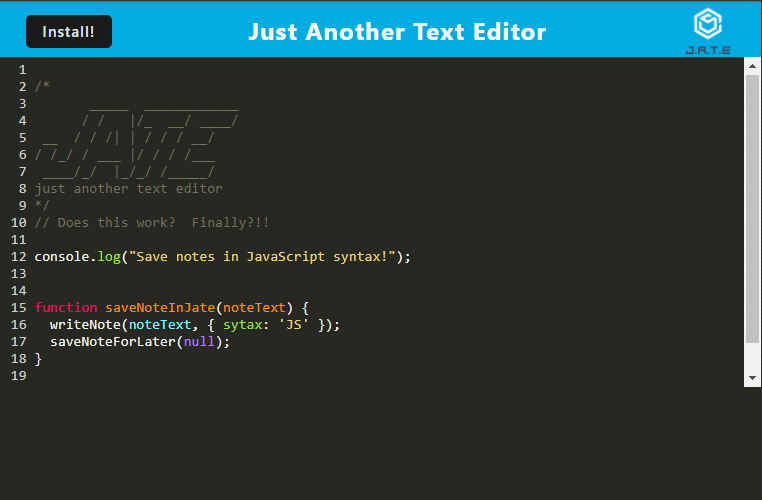

# PWA Text Editor - J.A.T.E

## Description
**J**ust **A**nother **T**ext **E**ditor (J.A.T.E) uses [CodeMirror](https://codemirror.net/) to provide a basic text editor with JavaScript syntax highlighting in the browser.  J.A.T.E is installable as a [progressive web app](https://en.wikipedia.org/wiki/Progressive_web_app) from within supported desktop and mobile browsers.  J.A.T.E is served from a simple [nodejs](https://nodejs.org/en) backend using [Express](https://expressjs.com/).  The web browser's [IndexDB API](https://developer.mozilla.org/en-US/docs/Web/API/IndexedDB_API) (through the [idb](https://www.npmjs.com/package/idb) package) saves the text you type in J.A.T.E. You can navigate away or close the browser and come back to find everything you've entered.   
**PWA Text Editor (J.A.T.E.) Live Example: [https://kitrath-jate.herokuapp.com](https://kitrath-jate.herokuapp.com/)**
## Installation
For local development:
1. Clone this repository: `git clone git@github.com:kitrath/pwa-text-editor`
2. Navigate to the base directory: `cd pwa-text-editor`
3. Install dependencies: `npm install`
6. Start the server: `npm start`
7. Visit `http://localhost:3000` in your browser
## Usage
Think of J.A.T.E. as a persistent scratch-pad with JavaScript syntax highlighting. Type note comments or code snippets in the editor window.  Changes to the text will continuously save and persist when you navigate away or close the application.  Click the install button in the top left navigation bar button to install J.A.T.E. as an app on your device that you can open from in icon on your homescreen or desktop.

## Screenshot

